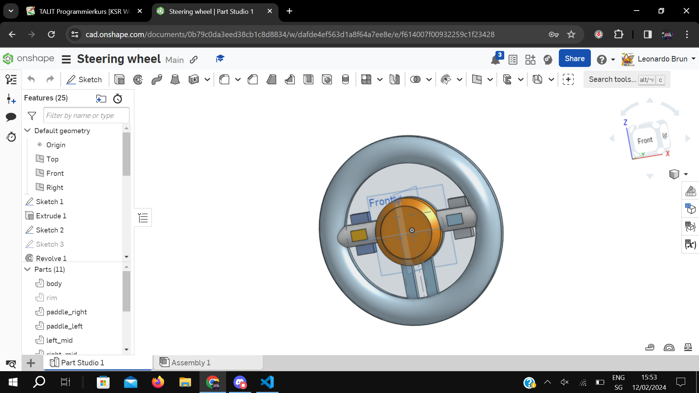

# Project Twintail

## Concept

The final envisioned product should consist of a station, with a steering wheel, pedals, and video receiver, and a modified RC (radio control) car, which has a custom receiver, custom chassis, and a fpv camera.

### Transmission Station

The transmission station consists of a steering wheel connected to the box via a shaft, and pedals, cable-connected, to the box. Inside the box we will have a rotary encoder which is connected to the main shaft via gears to prevent any damage and prevent the shaft from yeeting out. The sensors will all connect to a custom PCB, which has an Arduino pro mini, transmission antenna, and headers to plug the sensors in. 

#### Steering Wheel 

 

The steering wheel will be custom designed in CAD and then 3D printed.

##### basic dimensions 

- 32cm diameter
- 3.5cm-4cm handle width

##### features

- Paddle shifters
- 2 toggle buttons to switch from a programmed manual and automatic mode
- 2 toggle buttons to switch steering angles, i.e. race mode -90° ~ 90°, and regular -360° ~ 360°
- mechanical way to return rotation to 0°

#### Pedals

The pedals will be designed in CAD and 3 printed. It should be durable, comfortable, have adequate resistance. Using potentiometer to get values.

### Receiver

Built on top of a custom PCB, it should receive data from the transmitter and apply it to the rc car. To achieve this a brushless rc cars receiver will be replaced by the custom built one. On top of that a chassis with mounting space for an fpv camera should be designed and 3D printed. The camera footage will be transmitted live by the camera to a radio video transmitter which links up to any device.

## Possible issues

- Range, it should be at least 200m
- Something blows up
- Crashing the vehicle 

## Parts to be built

Time () => Minimum Expected Time 
Requirements {} => Things required

- 2 Arduino units, for transmittor and recievor (2-3 weeks) {req: parts}
- pedals (2 weeks) {req: parts}
- steering wheel (3-4 weeks) {req: parts}
- box (2 weeks) {req: steering wheel, pedals, transmittor}
- chassis (2 weeks) {req: parts}
- Final touches (1-4 weeks) {req: all}
- Something goes wrong time (2-8 weeks) {req: smth goes wrong :( }

## Electronic Design Answers

- The reciever would be replaced so that fine custom control can be programmed into the arduino based reciever. This wouldn't be possible with the original reciever.
- The video transmission is completly seperate from the arduino based transmission. (fpv camera comes with a transmittor -> read with fpv reciever)
- Failsafes will be added to ensure reliability. e.g. if connection is lost the motor cuts off, bringing a car to a stop.
- Testing should be done on the stock car, on a zig-zag track to test latency. And then with the modifications the car should still be able to do the zig-zag test. 

## Milestones

- Values are sent and recieved
- Wheel & Pedals work
- Chassis with camera fits
- First Run
- Runs # Project Twintail

## Dates

- First weeks b4 material arrives design the parts and start printing them.

