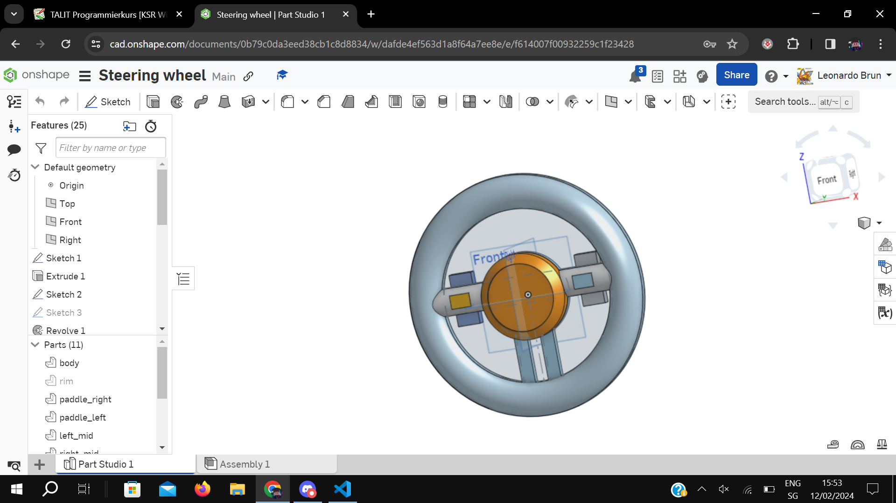

# Hardware project idea

## Steering wheel, peddal, controlled fpv rc car using custom arduino rc transmitor and reciever.

### Steering wheel 

- Paddle shifters

- manual/automatic button

- steering angle adjustment button

3D printed wheel connects to a box which holds it in place. The rod connecting the wheel to the box will have a gear at the box end which will rotate a motary encoder giving steering angle. -> Arduino transmitter

### Paddles

- Gas

- Break

3D printed peddals, using springs to simulate resistance and pots to measure how much is pressed  -> Arduino transmitter

### Modified RC Car

- Camera

- Custom Reciever

- 3D printed chassis

- Brushless

